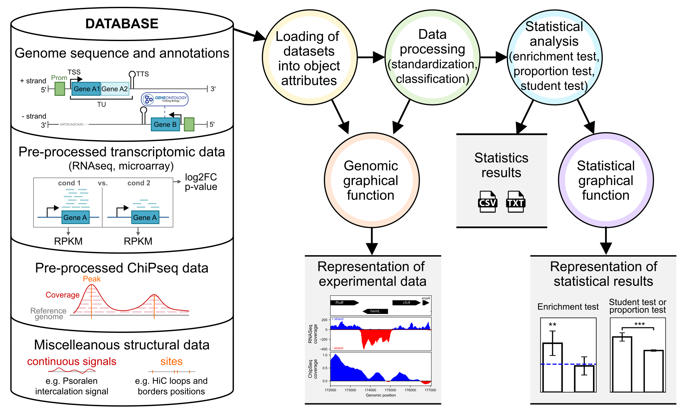

Presentation
============

Please set the environment variable $TOPO_DATABASE_PATH to the topo_database folder which contains the database in order to have $TOPO_DATABASE_PATH + data/organisms (e.g. $TOPO_DATABASE_PATH = /home/usr/documents/topo_database/). The most convenient way to run topo DB is probably to install a virtual environment.

Before using the package, the user needs to prepare and organize their data and database. For each new organism, the user must create a folder with the organism's name. Inside this folder, a subfolder named "annotation" should be created and the user should add the sequence data in fasta format and an annotation file in gff format in this folder. The pre-processed and formatted experimental data, should also be placed in an appropriate folder, named according to the data type. These experimental data files should be accompanied by an info file that the user needs to complete with information about the file organization, following the info file template for that data type.

The data analysis using the package is performed, by executing Python commands, in three major steps. Firstly, as the package is an object-oriented framework, the objects (Genome, Transcriptome, ChIP-Seq, etc.) need to be initialized, and then the data can be loaded as attributes. In this first step, the sequence and annotation can be added to the Genome object, signals and sites can be added to the ChIP-Seq object, omics data can be added to the Transcriptome object, and functional annotations can be loaded onto the GO object.

The second step involves data processing. During this step, attributes associated with genomic positions can be scaled to the gene level for further analysis. Additionally, the loaded continuous signals can be binned, smoothed, or averaged. A verification and graphical exploration of the signals can be performed at the end of the first or second step using a graphical function that plots the signals on the annotated genome. To prepare for statistical analysis, quantitative data can also be classified.

The last step is the statistical analysis with enrichment or proportion tests (for qualitative attributes) and student's t-tests (for quantitative comparisons). These functions can also be used to treat new data imported by the user, as long as they are formatted as Python dictionaries . Tests results are saved as tables (in csv format) and can be visualized as annotated bar plots created with graphical functions included in the package. 
